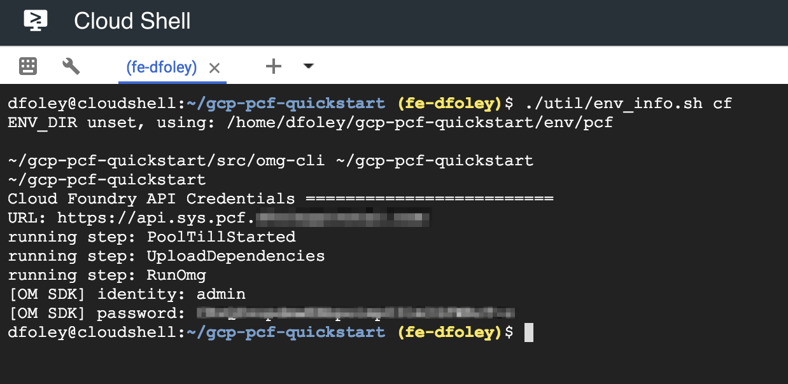

  
Update: September 5, 2018

## Introduction

This workshop will walk you through the process of deploying and monitoring an application on **Pivotal Cloud Foundry (PCF)**. PCF will be running on **Google Cloud Platform (GCP)** and you will get exposed how PCF consumes GCP services.

***To log issues***, click here to go to the [github](https://github.com/dfoleypivotal/gcp-pcf-workshop/issues) repository issue submission form.

## Objectives
- Install PCF on GCP using Quickstart
- Deploy an Application to PCF
- Understand how to Monitoring and Logging works in PCF
- Scale the number of instances of your application
- Understand High Availability capabilites of PCF platform
- Consume GCP Services from PCF application
- View PCF logs with GCP Stackdriver
- Understand how to do a Blue Green Deployment
- Setup Application Autoscaler

## Required Artifacts
- The following lab requires an Google Cloud Platform account.

## Create PCF platform on GCP using Quickstart.

### **STEP 1**: Open Cloud Shell
- From any browser, go to the URL to access Google Cloud Console:

   `https://console.cloud.google.com/`

- After you login to your GCP account click on Cloud Shell in the upper right hand corner.

    

- Cloud Shell will open in the bottom of your browser.

    

### **STEP 2**: Install PCF on GCP
- Open a new tab and go the following URL:

   `https://github.com/cf-platform-eng/gcp-pcf-quickstart`

- Follow the instruction for prerequisites, setup DNS and Deploy PCF

    ***Note:*** Throughout the document we will reference *`<yourdomain>`* as the DNS entry. Document will also assume that Cloud DNS was setup using *`pcf.<yourdomain>`*.

### **STEP 3**: Login to Pivotal Cloud Foundry

- From the PCF GCP Quickstart directory run the following command to get login information for Ops Manager:

    ```./util/env_info.sh opsman```

    

- From any browser, open a new tab and go to the URL to access Pivotal Ops Manager.  Use the username and password returned from the command above to login. 

    

- From the PCF GCP Quickstart directory run the following command to get login information for Apps Manager:

    ```./util/env_info.sh cf```

    

- From any browser, open a new tab and go to the URL:

   `https://apps.sys.pcf.<yourdomain>`

 - To access Pivotal Apps Manager.  Use the username and password returned from the command above to login. 

    

- Leave both Ops Manager and Apps Manager tabs open as we will be using them later in the lab.

- Now we want to target out CLI at our newly created environment. From Cloud Shell run the following commands to target and login to CF CLI. For ***Space*** selection hit Enter as we will create a new org and space for application deployment.

```
cf api https://api.sys.pcf.<yourdomian> --skip-ssl-validation
cf login -u admin -p <password from above>
```


## Orgs and Spaces

An ***org*** is a development account that an individual or multiple collaborators can own and use. All collaborators access an org with user accounts. Collaborators in an org share a resource quota plan, applications, services availability, and custom domains.

Every application and service is scoped to a ***space***. An org can contain multiple spaces. A space provides users with access to a shared location for application development, deployment, and maintenance. Each space role applies only to a particular space.

For more information you can access Pivotal Documentation at [here](https://docs.pivotal.io/pivotalcf/2-2/concepts/roles.html)


### **STEP 4**: Create Org and Space

- We will now use the CLI to create a new Org and Space for deployment of our applications. We will create and Org call ***demo*** and them create a space in that Org call ***dev***.

```
cf create-org demo
cf create-space dev -o demo
```


- Now we want to target our CF CLI to this newly created Org and Space:

```
cf target -o demo -s dev
```


- We are now ready to start deploying applications to our platform.

## Pushing Apps

### **STEP 5**: Download Lab Resource

- We will clone the workshop repository to gain access to all the lab materials.  This guide will assume you are doing the clone from your home directory in Cloud Shell.

```
cd ~
git clone https://github.com/dfoleypivotal/gcp-pcf-workshop.git
```


### **STEP 6**: Pushing Apps

In ***pcf-developer-workshop*** folder you will find
a ***demo-apps*** directory. It contains four sub-directories; each
directory contains an application developed in a different
language.

- We will start by deploying a basic Node application. Change to the node demo app directory.

```
cd gcp-pcf-workshop/pcf-developer-workshop/demo-apps/node/
```

- The Cloud Foundry push command assumes that the artifacts for
your application are located in the current working directory.

***Note:*** node must be your current directory, not demo-apps. This
is a common-mistake.

- Now push the ***node*** application:

```
cf push node --random-route -m 128M
```


- We can new use the ***cf apps** command to view all the deployed applications:

```
cf apps
```


- Make note of the url for you ***node*** application. Now, visit the node application in your browser, or use curl. Expected response is ***Hello Node***

```
curl <your node application url>
```


- Lets repeat the process but with the ***php*** application:

```
cd ../php/
cf push php --random-route -m 128M
```


- We can new use the ***cf apps** command to view all the deployed applications:

```
cf apps
```


- Make note of the url for you ***php*** application. Now, visit the php application in your browser, or use curl. Expected response is ***Hello PHP***

```
curl <your php application url>
```


- Repeat these steps for the python and ruby applications.

You just deployed four applications each based on a different
language and runtime. Pivotal Cloud Foundry is a polyglot
platform, meaning it supports multiple languages and does so in
a pluggable way (via buildpacks)!

- Switch over to you browser and let refresh the Apps Manger page. You may have to login again. On the left hand side select the ***demo*** ORG and then select the ***dev** SPACE. You should now see all 4 application.

    

- Apps Manager give you a GUI that allows you to manage all your deployments the same way you would via the CF CLI. Click around to get familiar with the Apps Manager.  If you click on one of the applications you can see some of the controls you have for each application.

    

### **STEP 7**: Cleanup

- We can now remove these application as they will not be used throughout the rest of the lab.  You can either delete the application using Apps Manager or CLI.  Below is the command to remove via the CLI.

```
cf delete node
```


- Repeat to delete the php, python, and ruby applications.

### **STEP 8**: Push the articulate application:

- We will now deploy a Java Spring application call ***articulate*** that will be used for the remainder of the lab. The ***--no-start*** argument allows you to stage the application. 

```
cd ~/gcp-pcf-workshop/pcf-developer-workshop/articulate/
cf push articulate -p ./articulate-0.2.jar -m 768M --random-route --no-start
``` 


- Now let's start the application. 

```
cf start articulate
```


- Notice that the state is ***started***. Open a new browser tab and view the articulate application using the route assigned. Read about
our demo application.

    


