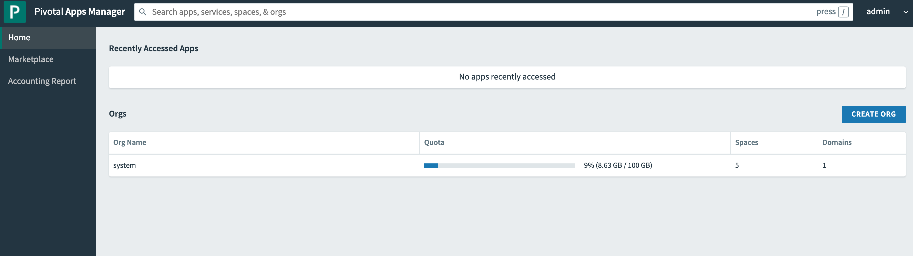
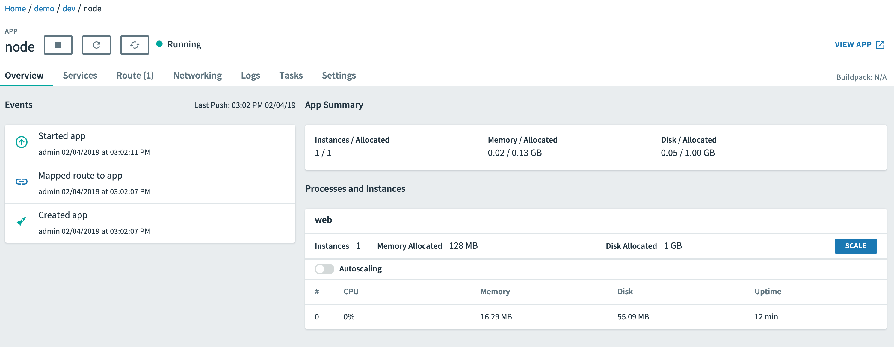
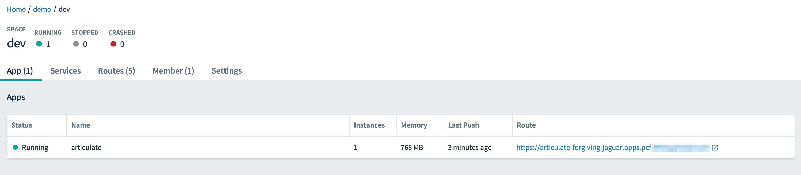
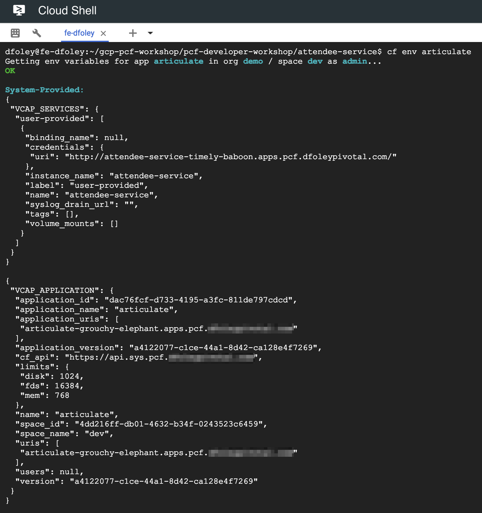
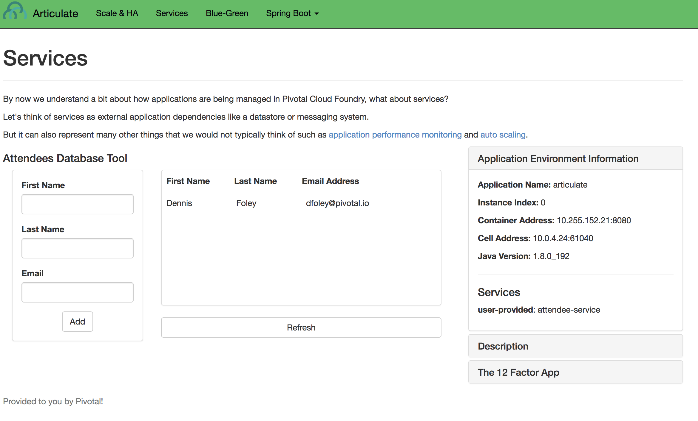

  
Update: September 5, 2018

## Introduction

This workshop will walk you through the process of deploying and monitoring an application on **Pivotal Cloud Foundry (PCF)**. PCF will be running on **Google Cloud Platform (GCP)** and you will get exposed how PCF consumes GCP services.

***To log issues***, click here to go to the [github](https://github.com/dfoleypivotal/gcp-pcf-workshop/issues) repository issue submission form.

## Objectives
- Install PCF on GCP using Quickstart
- Deploy an Application to PCF
- Understand how to Monitoring and Logging works in PCF
- Scale the number of instances of your application
- Understand High Availability capabilites of PCF platform
- Consume GCP Services from PCF application
- View PCF logs with GCP Stackdriver
- Understand how to do a Blue Green Deployment
- Setup Application Autoscaler

## Required Artifacts
- The following lab requires an Google Cloud Platform account.

## Create PCF platform on GCP using Quickstart.

### **STEP 1**: Open Cloud Shell
- From any browser, go to the URL to access Google Cloud Console:

   `https://console.cloud.google.com/`

- After you login to your GCP account click on Cloud Shell in the upper right hand corner.

    

- Cloud Shell will open in the bottom of your browser.

    

### **STEP 2**: Install PCF on GCP
- Open a new tab and go the following URL:

   `https://github.com/cf-platform-eng/gcp-pcf-quickstart`

- Follow the instruction for prerequisites, setup DNS and Deploy PCF

    ***Note:*** Throughout the document we will reference *`<yourdomain>`* as the DNS entry. Document will also assume that Cloud DNS was setup using *`pcf.<yourdomain>`*.

### **STEP 3**: Login to Pivotal Cloud Foundry

- From the PCF GCP Quickstart directory run the following command to get login information for Ops Manager:

    ```./util/env_info.sh opsman```

    

- From any browser, open a new tab and go to the URL to access Pivotal Ops Manager.  Use the username and password returned from the command above to login. 

    

- From the PCF GCP Quickstart directory run the following command to get login information for Apps Manager:

    ```./util/env_info.sh cf```

    

- From any browser, open a new tab and go to the URL:

   `https://apps.sys.pcf.<yourdomain>`

 - To access Pivotal Apps Manager.  Use the username and password returned from the command above to login. 

    

- Leave both Ops Manager and Apps Manager tabs open as we will be using them later in the lab.

- Now we want to target out CLI at our newly created environment. From Cloud Shell run the following commands to target and login to CF CLI. For ***Space*** selection hit Enter as we will create a new org and space for application deployment.

```
cf api https://api.sys.pcf.<yourdomian> --skip-ssl-validation
cf login -u admin -p <password from above>
```


## Orgs and Spaces

An ***org*** is a development account that an individual or multiple collaborators can own and use. All collaborators access an org with user accounts. Collaborators in an org share a resource quota plan, applications, services availability, and custom domains.

Every application and service is scoped to a ***space***. An org can contain multiple spaces. A space provides users with access to a shared location for application development, deployment, and maintenance. Each space role applies only to a particular space.

For more information you can access Pivotal Documentation at [here](https://docs.pivotal.io/pivotalcf/2-2/concepts/roles.html)


### **STEP 4**: Create Org and Space

- We will now use the CLI to create a new Org and Space for deployment of our applications. We will create and Org call ***demo*** and them create a space in that Org call ***dev***.

```
cf create-org demo
cf create-space dev -o demo
```


- Now we want to target our CF CLI to this newly created Org and Space:

```
cf target -o demo -s dev
```


- We are now ready to start deploying applications to our platform.

## Pushing Apps

### **STEP 5**: Download Lab Resource

- We will clone the workshop repository to gain access to all the lab materials.  This guide will assume you are doing the clone from your home directory in Cloud Shell.

```
cd ~
git clone https://github.com/dfoleypivotal/gcp-pcf-workshop.git
```


### **STEP 6**: Pushing Apps

In ***pcf-developer-workshop*** folder you will find
a ***demo-apps*** directory. It contains four sub-directories; each
directory contains an application developed in a different
language.

- We will start by deploying a basic Node application. Change to the node demo app directory.

```
cd gcp-pcf-workshop/pcf-developer-workshop/demo-apps/node/
```

- The Cloud Foundry push command assumes that the artifacts for
your application are located in the current working directory.

***Note:*** node must be your current directory, not demo-apps. This
is a common-mistake.

- Now push the ***node*** application:

```
cf push node --random-route -m 128M
```


- We can new use the ***cf apps** command to view all the deployed applications:

```
cf apps
```


- Make note of the url for you ***node*** application. Now, visit the node application in your browser, or use curl. Expected response is ***Hello Node***

```
curl <your node application url>
```


- Lets repeat the process but with the ***php*** application:

```
cd ../php/
cf push php --random-route -m 128M
```


- We can new use the ***cf apps** command to view all the deployed applications:

```
cf apps
```


- Make note of the url for you ***php*** application. Now, visit the php application in your browser, or use curl. Expected response is ***Hello PHP***

```
curl <your php application url>
```


- Repeat these steps for the python and ruby applications.

You just deployed four applications each based on a different
language and runtime. Pivotal Cloud Foundry is a polyglot
platform, meaning it supports multiple languages and does so in
a pluggable way (via buildpacks)!

- Switch over to you browser and let refresh the Apps Manger page. You may have to login again. On the left hand side select the ***demo*** ORG and then select the ***dev** SPACE. You should now see all 4 application.

    

- Apps Manager give you a GUI that allows you to manage all your deployments the same way you would via the CF CLI. Click around to get familiar with the Apps Manager.  If you click on one of the applications you can see some of the controls you have for each application.

    

### **STEP 7**: Cleanup

- We can now remove these application as they will not be used throughout the rest of the lab.  You can either delete the application using Apps Manager or CLI.  Below is the command to remove via the CLI.

```
cf delete node
```


- Repeat to delete the php, python, and ruby applications.

### **STEP 8**: Push the articulate application

- We will now deploy a Java Spring application call ***articulate*** that will be used for the remainder of the lab. The ***--no-start*** argument allows you to stage the application. 

```
cd ~/gcp-pcf-workshop/pcf-developer-workshop/articulate/
cf push articulate -p ./articulate-0.2.jar -m 768M --random-route --no-start
``` 


- Now let's start the application. 

```
cf start articulate
```


- Notice that the state is ***started***. Open a new browser tab and view the articulate application using the route assigned. Read about
our demo application.

    

## Logging

### **STEP 9**: Tail the Logs

- Go to the App Manager in your browser, open the articulate application and view the logs in the Logs tab. On the top-right there is an icon with a "Go" arrow in (which pops up tail logs when you mouse over it - see below). Click to start tailing mode. Once log-tailing is enabled the "Go" arrow changes to a

    
    

- To view logs via CLI issue the following command:

```
cf logs articulate --recent
```


## Scale and High Availability

Pivotal Cloud Foundry has 4 levels of HA (High Availability) that keep your applications and the underlying platform running. In this section, we will demonstrate one of them. Failed application instances will be recovered.

### **STEP 10**: Scale the App

- In a Cloud Shell, scale the articulate application to 2 instances.

```
cf scale articulate -i 2
```


- Execute the following command to see state of the application

```
cf app articulate
```


- Back on the browser, click ***Scale & HA*** in the articulate application. Click ***Refresh*** button and wath the ***Instance Index*** change.

    

### **STEP 11**: High Availability

- Press the Kill button

    

- Back in the Cloud Shell execute the following command. If you catch it fast enought you will see that the killed instance was restarted. A new, healthy app instance has been automatically provisioned to replace the failing one.

```
cf app articulate
```


- Execute the following command to view which instance was killed.

```
cf events articulate
```


- Scale articulate back to our original settings.

```
cf scale articulate -i 1
cf app articulate
```


## Services

Up until now, we’ve focused on the deployment of applications. But as we know, applications often use backing services: databases, message brokers, and other applications' services (to name a few).

In this lab, you’ll have the opportunity to experiment with both managed services and user-provided services: you’ll create a mysql backing service to persist information about attendees, and you’ll create a user-provided service to allow one application to consume the services of another without hard-coding its route.

In the process, you’ll learn new cf commands: create-service, create-user-provided-service, and bind-service. Don’t forget: cf help is there to help us understand how to invoke each command.

articulate exposes functionality to add attendees on the Services page. However, articulate doesn’t do this alone. It makes REST calls to the attendee-service application. To learn more about services, let’s provision the attendee-service application.

### **STEP 12**: Push the attendee-service application

- The attendee-service JAR, attendee-service-0.1.jar is in your lab files under its own directory.

- Execute the following commands to push the attendee-service application.

```
cd ~/gcp-pcf-workshop/pcf-developer-workshop/attendee-service/
cf push attendee-service -p ./attendee-service-0.1.jar -m 768M --random-route
```


***Note:*** When you push attendee-service it will fail because it references a MySql database which we have not created yet.


### **STEP 13**: Create Service via GCP Service Broker

PCF operators install the GCP Service Broker to expose select GCP services in the Marketplace. Developers can then provision GCP services by creating and managing service instances with the cf CLI.

Review the [documentation](https://docs.pivotal.io/partners/gcp-sb/index.html) for more information.

- Review what services are available in the marketplace

```
cf marketplace
```


- As you can see many of the GCP services are available. Lets see what plans are available for Cloud SQL.

```
cf marketplace -s google-cloudsql-mysql
``` 


- Create a Cloud SQL MySQL database from the marketplace.

```
cf create-service google-cloudsql-mysql mysql-micro-dev attendee-mysql
```


- You can monitory the progress with the following command.

```
cf service attendee-mysql
```


- You can also view the progress from the GCP Console.  Back in the browser navigate to the SQL services in the GCP Console.

    

- Wait until the Cloud SQL instance has create succeeded

    

- Since we are not created a client certificate we will want to allow unsecured connections to the database.  Back on the GCP Console click the newly create database and click on the ***connections*** page.

    

- Scroll down and click ***Allow unsecured connection***

    

### **STEP 14**: Bind Service

- Now that we have a running database we need to bind the service to the application.

```
cf bind-service attendee-service attendee-mysql -c '{"role":"cloudsql.admin"}'
```


- To make things easy for the lab we will create a network that allows access to the database from the public internet. Click ***Add network*** and add a new with ***CIDR*** 0.0.0.0/0. Click ***Save***

    

- Restart the application

```
cf restart attendee-service
```


- View the attendee-service in a browser.

    

- An http GET to the attendees endpoint will fetch all attendees in the database and display them in JSON format. This application implements a RESTful API. This means that you
should be able to submit http POST to the same attendees endpoint with a body containing the JSON representation of the Attendee model type to create such a record. This can be
done programmatically, or via REST client tools such as Postman or command-line tools such as curl or httpie.

### **STEP 14**: Add a User-Provided Service Instance

In the enterprise, not all services will be provisioned by Pivotal Cloud Foundry. For example, consider your Oracle RAC cluster. How can we connect our applications running on Pivotal Cloud Foundry to these external systems? Additionally, how can we easily connect applications together running on the platform? articulate’s default configuration for the attendee-service
uri is http://localhost:8181/ . The subsequent steps will allow you to override the default configuration with your own.

- Create a user-provided service instance. 

```
cf create-user-provided-service attendee-service -p uri
```

***Note:*** This will create an interactive prompt. For the value of uri, enter your attendee-service application's base url:

uri> https://{{attendees_app_uri}}/


- Bind articulate to the attendee-service user-provided service.

```
cf bind-service articulate attendee-service
```


- Restart the application.

```
cf restart articulate
```


- Refresh the articulate Services page. You can now see the attendee-service listed under Services.

    

- Review the environment.

```
cf env articulate
```


- Add some attendees.

    

## Log Drain

Cloud Foundry’s loggregator subsystem routes application’s log streams out of the containers from which they emanate and makes them accessible via the cf logs command. But what if you needed to maintain a month’s worth of logs, and wanted to leverage third party tools or services for log analysis? Cloudfoundry provides the capability to drain application logs to some destination, whether it be an internal enterprise system or a third-party service.

Pivotal Cloud Foundry does not persist logs. For long term storage of logs, drain logs to a third-party log management service.

### **STEP 14**: GCP Stackdriver Nozzle for PCF

GCP Stackdriver Nozzle for PCF includes the following key features:

- Simplified configuration for the Stackdriver Nozzle
- Resolved Cloud Foundry application metadata (for example, app name) in logs and metrics
- Search, alert on, and create dashboards for logs and metrics generated by Cloud Foundry
- Integration with Stackdriver Logging and Monitoring consoles
- Configurable black/whitelisting of events from the Loggregator Firehose

For more information you can access Pivotal Documentation at [here](https://docs.pivotal.io/partners/gcp-sdn/index.html)

- Navigate to the Stackdriver Log Viewer for your GCP Project

- Select the ***Global*** resource and click on the ***Play*** button to see the logs streaming from your PCF deployment. 

    

### **STEP 15**: Monitor your PCF Deployment

- Navigate to the Stackdriver Monitoring Console for your GCP project.

- Select ***Dashboards > Create Dashboard***

- Click ***Add Chart**

    

- Enter the following information and click ***Save***

   **Chart Titel:** `CPU Usage`

   **Resource Type and metric:** `custom/firehose/rep.cpuPercentage`

    
    

- Monitor the logs as you execute different command.  Try the following and see what you see in the Log Viewer:

```
cf restart articulate
```


