  
Update: November 29, 2018

## Introduction

This workshop will walk you through the process of deploying and monitoring an application on **Pivotal Cloud Foundry (PCF)**. PCF will be running on **Google Cloud Platform (GCP)** and you will get exposed to how PCF consumes GCP services.

***To log issues***, click here to go to the [github](https://github.com/dfoleypivotal/gcp-pcf-workshop/issues) repository issue submission form.

## Objectives
- [Install PCF on GCP using Quickstart](#install)
- [Deploy an Application to PCF](#pushapp)
- [Understand how to Monitoring and Logging works in PCF](#logging)
- [Scale the number of instances of your application](#ha)
- [Understand High Availability capabilities of PCF platform](#ha)
- [Setup Application Autoscaler](#autoscaler)
- [Consume GCP Services from PCF application](#services)
- [Understand how to do a Blue Green Deployment](#bluegreen)
- [PAS Administrator Functions](#pasadmin)
- [BOSH Troubleshooting](#boshadmin)

## Required Artifacts
- The following lab requires a Google Cloud Platform account.
- A registered domain name is required to deploy PCF.

<a id="install"></a>
## Create PCF platform on GCP using Quickstart. 

### **STEP 1**: Open Cloud Shell
- From any browser, go to the URL to access Google Cloud Console:

   <https://console.cloud.google.com/>

- After you login to your GCP account click on Cloud Shell in the upper right hand corner.

    

- Cloud Shell will open in the bottom of your browser.

    

### **STEP 2**: Install PCF on GCP
- Open a new tab and go the following URL:

   <https://github.com/cf-platform-eng/gcp-pcf-quickstart>

- Follow the instruction for **prerequisites**, **setup DNS** and **Deploy PCF**

    **Note:** Throughout the document we will reference *`<yourdomain>`* as the DNS entry. Document will also assume that Cloud DNS was setup using *`pcf.<yourdomain>`*.

- Once the deployment completes you can move to **STEP 3**

    

### **STEP 3**: Login to Pivotal Cloud Foundry

- **Ops Manager** for Pivotal Cloud Foundry (PCF) provides a set of APIs and a graphical interface to manage the deployment and upgrade of PCF components. Use Ops Manager to administer Elastic Runtime, data services, and partner products.

- From the PCF GCP Quickstart directory run the following command to get login information for Ops Manager:

```bash
./util/env_info.sh opsman
```


- From any browser, open a new tab and go to the URL to access Pivotal Ops Manager.  Use the username and password returned from the command above to login. 

    

- **Apps Manager** is a web-based tool for managing Pivotal Application Service (PAS) organizations, spaces, applications, services, and users.

- From the PCF GCP Quickstart directory run the following command to get login information for Apps Manager:

```bash
./util/env_info.sh cf
```


- From any browser, open a new tab and go to the URL:

   `https://apps.sys.pcf.<yourdomain>`

 - To access Pivotal Apps Manager.  Use the username and password returned from the command above to login. 

    

- Leave both Ops Manager and Apps Manager tabs open as we will be using them later in the lab.

- Now we want to target out CLI at our newly created environment. From Cloud Shell run the following commands to target and login to CF CLI. For **Space** selection hit Enter as we will create a new org and space for application deployment.

```bash
cf api https://api.sys.pcf.<yourdomian> --skip-ssl-validation
cf login -u admin -p <password from above>
```


## Orgs and Spaces

An **org** is a development account that an individual or multiple collaborators can own and use. All collaborators access an org with user accounts. Collaborators in an org share a resource quota plan, applications, services availability, and custom domains.

Every application and service is scoped to a **space**. An org can contain multiple spaces. A space provides users with access to a shared location for application development, deployment, and maintenance. Each space role applies only to a particular space.

For more information you can access Pivotal Documentation at [here](https://docs.pivotal.io/pivotalcf/2-2/concepts/roles.html)


### **STEP 4**: Create Org and Space

- We will now use the CLI to create a new Org and Space for deployment of our applications. We will create and Org call **demo** and them create a space in that Org call **dev**.

```bash
cf create-org demo
cf create-space dev -o demo
```


- Now we want to target our CF CLI to this newly created Org and Space:

```
cf target -o demo -s dev
```


- We are now ready to start deploying applications to our platform.

<a id="pushapp"></a>
## Pushing Apps 

You deploy an app to Cloud Foundry by running a cf push command from the Cloud Foundry Command Line Interface (cf CLI). Between the time that you run cf push and the time that the app is available, Cloud Foundry performs the following tasks:

- Uploads and stores app files
- Examines and stores app metadata
- Creates a “droplet” (the Cloud Foundry unit of execution) for the app
- Selects an appropriate Diego cell to run the droplet
- Starts the app

For more information about the lifecycle of an app, see the [Application Container Lifecycle](https://docs.run.pivotal.io/devguide/deploy-apps/app-lifecycle.html) topic.

### **STEP 5**: Download Lab Resource

- We will clone the workshop repository to gain access to all the lab materials.  This guide will assume you are doing the clone from your home directory in Cloud Shell.

```bash
cd ~
git clone https://github.com/dfoleypivotal/gcp-pcf-workshop.git
```


### **STEP 6**: Pushing Apps

In **pcf-developer-workshop** folder you will find a **demo-apps** directory. It contains four sub-directories; each directory contains an application developed in a different language.

- We will start by deploying a basic Node application. Change to the node demo app directory.

```basg
cd gcp-pcf-workshop/pcf-developer-workshop/demo-apps/node/
```

- The Cloud Foundry push command assumes that the artifacts for your application are located in the current working directory.

- Now push the **node** application:

```bash
cf push node --random-route -m 128M
```


- We can new use the **cf apps** command to view all the deployed applications:

```bash
cf apps
```


- Make note of the url for you **node** application. Now, visit the node application in your browser, or use curl. Expected response is **Hello Node**

```bash
curl <your node application url>
```


- Lets repeat the process but with the **php** application:

```bash
cd ../php/
cf push php --random-route -m 128M
```


- We can new use the **cf apps** command to view all the deployed applications:

```bash
cf apps
```


- Make note of the url for you **php** application. Now, visit the php application in your browser, or use curl. Expected response is **Hello PHP**

```bash
curl <your php application url>
```


- Repeat these steps for the **python** and **ruby** applications.

You just deployed four applications each based on a different language and runtime. Pivotal Cloud Foundry is a polyglot platform, meaning it supports multiple languages and does so in a pluggable way (via buildpacks)!

- Switch over to you browser and let refresh the Apps Manger page. You may have to login again. On the left hand side select the **demo** ORG and then select the **dev** SPACE. You should now see all 4 application.

    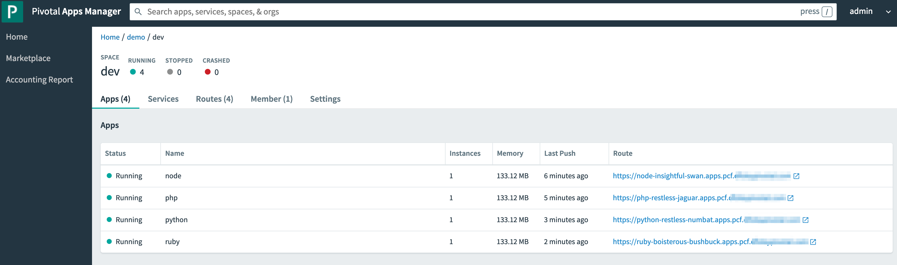

- Apps Manager gives you a GUI that allows you to manage all your deployments the same way you would via the CF CLI. Click around to get familiar with the Apps Manager.  If you click on one of the applications you can see some of the controls you have for each application.

    

### **STEP 7**: Cleanup

- We can now remove these application as they will not be used throughout the rest of the lab.  You can either delete the application using Apps Manager or CLI.  Below is the command to remove via the CLI.

```bash
cf delete node
```


- Repeat to delete the **php**, **python**, and **ruby** applications.

### **STEP 8**: Push the articulate application

- We will now deploy a Java Spring application call **articulate** that will be used for the remainder of the lab. The **--no-start** argument allows you to stage the application. 

```bash
cd ~/gcp-pcf-workshop/pcf-developer-workshop/articulate/
cf push articulate -p ./articulate-0.2.jar -m 768M --random-route --no-start
``` 


- Now let's start the application. 

```bash
cf start articulate
```


- Notice that the state is **started**. Open a new browser tab and view the articulate application using the route assigned. Read about
our demo application.

    

<a id="logging"></a>
## Logging

**Loggregator**, the Cloud Foundry component responsible for logging, provides a stream of log output from your app and from Cloud Foundry system components that interact with your app during updates and execution.

### **STEP 9**: Tail the Logs

- Go to the **App Manager** in your browser, open the **articulate** application and view the logs in the Logs tab. On the top-right there is an icon with a "Go" arrow in (which pops up tail logs when you mouse over it - see below). Click to start tailing mode. Once log-tailing is enabled the "Go" arrow changes to a

    
    

- To view logs via CLI issue the following command:

```bash
cf logs articulate --recent
```


- If you are not seeing any recent logs due to a time delay try the following command then re-execute the command above:

```bash
cf restart articulate
```

## Log Drain

Cloud Foundry’s loggregator subsystem routes application’s log streams out of the containers from which they emanate and makes them accessible via the cf logs command. But what if you needed to maintain a month’s worth of logs, and wanted to leverage third party tools or services for log analysis? Cloudfoundry provides the capability to drain application logs to some destination, whether it be an internal enterprise system or a third-party service.

Pivotal Cloud Foundry does not persist logs. For long term storage of logs, drain logs to a third-party log management service.

### **STEP 10**: GCP Stackdriver Nozzle for PCF

GCP Stackdriver Nozzle for PCF includes the following key features:

- Simplified configuration for the Stackdriver Nozzle
- Resolved Cloud Foundry application metadata (for example, app name) in logs and metrics
- Search, alert on, and create dashboards for logs and metrics generated by Cloud Foundry
- Integration with Stackdriver Logging and Monitoring consoles
- Configurable black/whitelisting of events from the Loggregator Firehose

For more information you can access Pivotal Documentation at [here](https://docs.pivotal.io/partners/gcp-sdn/index.html)

- Navigate to the Stackdriver Log Viewer for your GCP Project

- Click on the **Play** button to see the logs streaming from your PCF deployment. 

    

### **STEP 11**: Monitor your PCF Deployment

- Navigate to the Stackdriver Monitoring Console for your GCP project.

- Select **Dashboards > Create Dashboard**

- Click **Add Chart**

    

- Enter the following information and click **Save**

   **Chart Title:** `CPU Usage`

   **Resource Type and metric:** `custom/firehose/rep.cpuPercentage`

    
    

- Monitor the logs as you execute different command.  Try the following and see what you see in the Log Viewer:

```bash
cf restart articulate
```

<a id="ha"></a>
## Scale and High Availability

Pivotal Cloud Foundry has 4 levels of HA (High Availability) that keep your applications and the underlying platform running. To learn more please visit Pivotal [documentation](https://docs.pivotal.io/pivotalcf/1-12/concepts/high-availability.html)

In this section, we will demonstrate one of them. Failed application instances will be recovered.

### **STEP 12**: Scale the App

- In a Cloud Shell, scale the articulate application to 2 instances.

```bash
cf scale articulate -i 2
```


- Execute the following command to see state of the application

```bash
cf app articulate
```


- Back on the browser, click **Scale & HA** in the articulate application. Click **Refresh** button and wath the **Instance Index** change.

    

### **STEP 13**: High Availability

- Press the Kill button

    

- Back in the Cloud Shell execute the following command. If you catch it fast enought you will see that the killed instance was restarted. A new, healthy app instance has been automatically provisioned to replace the failing one.

```bash
cf app articulate
```


- Execute the following command to view which instance was killed.

```bash
cf events articulate
```
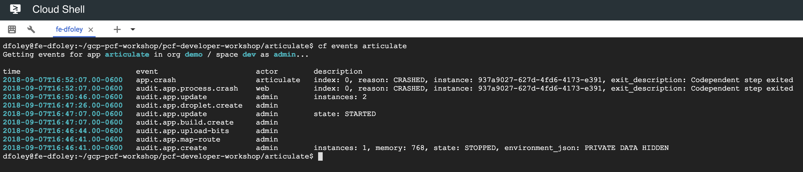

- Scale articulate back to our original settings.

```bash
cf scale articulate -i 1
cf app articulate
```


<a id="autoscaler"></a>
## Application Autoscaler 

So, you can deploy your app, you can scale it. But what if we wish to automate scaling an application up and down during periods of higher and subsequently lower traffic. PCF allows us to automate scaling via the marketplace service named the App Autoscaler.

- To learn more read the documentation about App [Autoscaling](https://docs.pivotal.io/pivotalcf/2-1/appsman-services/autoscaler/using-autoscaler.html).

### **STEP 14**: Setup App Autoscaling

- Create a autoscaler service instance.

```bash
cf create-service app-autoscaler standard autoscaler
```


- Bind the service to articulate.

```bash
cf bind-service articulate autoscaler
```

- Restart the application.

```bash
cf restart articulate
```


- Go to Apps Manager and click on **App** for the **dev** space.

    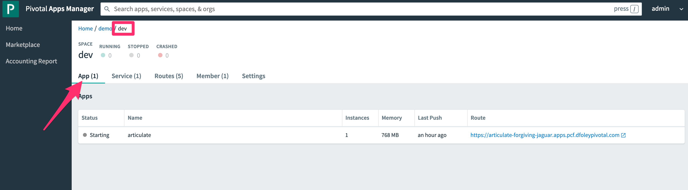

- Click on **articulate** to bring up application specific configuration.

    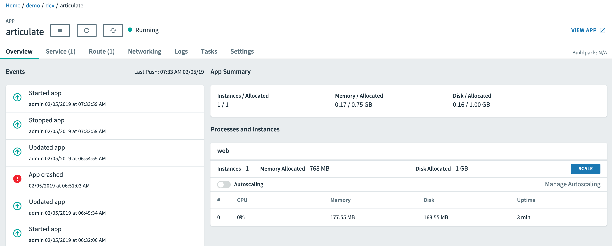

- Enable **Autoscaling** then click **Manage Autoscaling**

    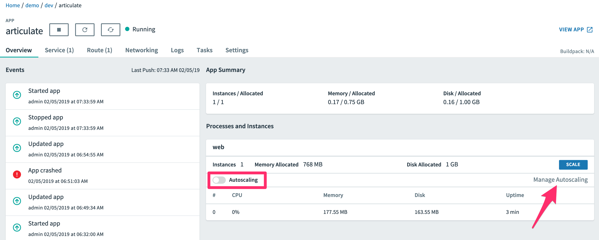

- Set Minimum Instance Limit to **3** and Maximum Instance Limit to **5**. Click **Apply Changes** and click **X** to exit Autoscaling configuration.

    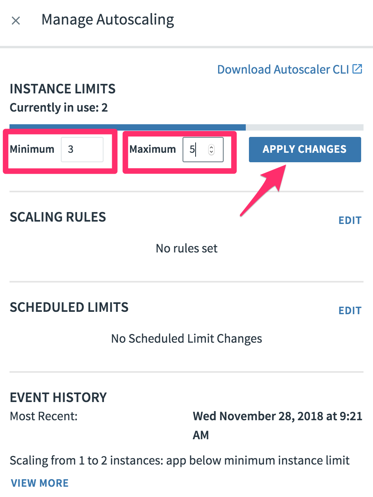

**Note:** Notice that after a short bit of time, the number of instances changes to 3 to reflect the minimum instance limit.

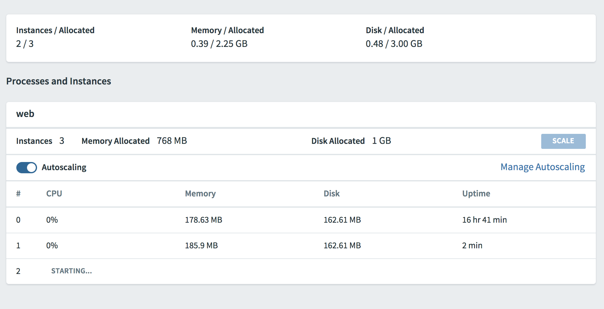

- To cleanup, Unbind the autoscaler service instance.

```bash
cf unbind-service articulate autoscaler
```

- Delete the autoscaler service instance.

```bash
cf delete-service autoscaler
```

- Scale articulate back to original settings.

```bash
cf scale articulate -i 1
```
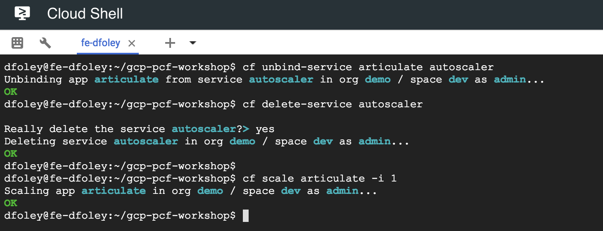

- Restart articulate.

```bash
cf restart articulate
```


<a id="services"></a>
## Services

Up until now, we’ve focused on the deployment of applications. But as we know, applications often use backing services: databases, message brokers, and other applications' services (to name a few).

In this lab, you’ll have the opportunity to experiment with both managed services and user-provided services: you’ll create a mysql backing service to persist information about attendees, and you’ll create a user-provided service to allow one application to consume the services of another without hard-coding its route.

In the process, you’ll learn new cf commands: create-service, create-user-provided-service, and bind-service. Don’t forget: cf help is there to help us understand how to invoke each command.

articulate exposes functionality to add attendees on the Services page. However, articulate doesn’t do this alone. It makes REST calls to the attendee-service application. To learn more about services, let’s provision the attendee-service application.

### **STEP 15**: Push the attendee-service application

- The attendee-service JAR, attendee-service-0.1.jar is in your lab files under its own directory.

- Execute the following commands to push the attendee-service application.

```bash
cd ~/gcp-pcf-workshop/pcf-developer-workshop/attendee-service/
cf push attendee-service -p ./attendee-service-0.1.jar -m 768M --random-route
```


**Note:** When you push attendee-service it will fail because it references a MySql database which we have not created yet.


### **STEP 16**: Create Service via GCP Service Broker

PCF operators install the GCP Service Broker to expose select GCP services in the Marketplace. Developers can then provision GCP services by creating and managing service instances with the cf CLI.

Review the [documentation](https://docs.pivotal.io/partners/gcp-sb/index.html) for more information.

- Review what services are available in the marketplace

```bash
cf marketplace
```


- As you can see many of the GCP services are available. Lets see what plans are available for Cloud SQL.

```bash
cf marketplace -s google-cloudsql-mysql
``` 

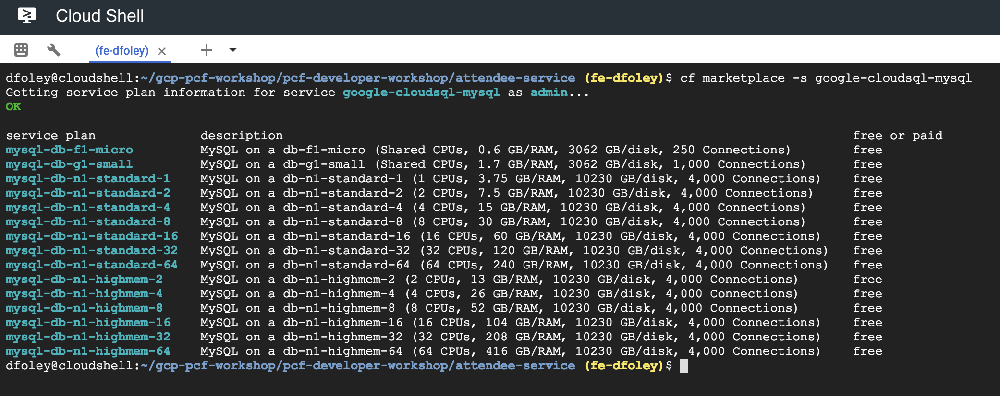

- Create a Cloud SQL MySQL database from the marketplace.

```bash
cf create-service google-cloudsql-mysql mysql-db-f1-micro attendee-mysql
```

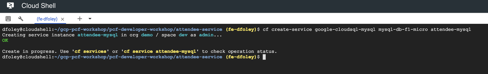

- You can monitory the progress with the following command.

```bash
cf service attendee-mysql
```

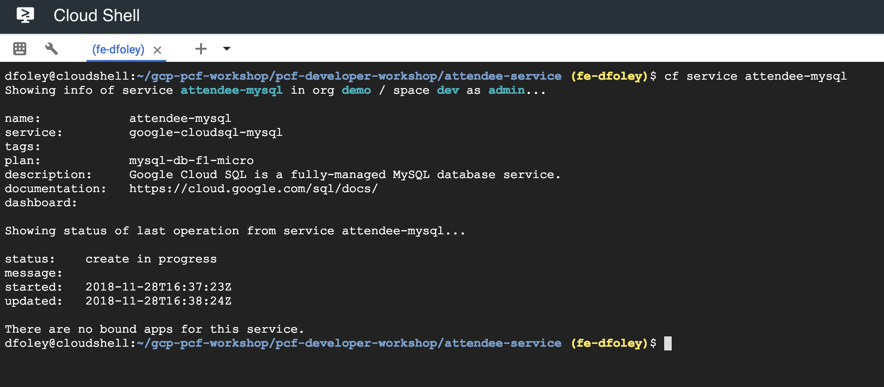

- You can also view the progress from the GCP Console.  Back in the browser navigate to the SQL services in the GCP Console.

    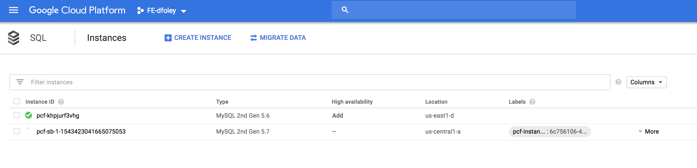

- Wait until the Cloud SQL instance has create succeeded

    

### **STEP 17**: Enable access to Database

- Back on the GCP Console click the newly create database and click on the **connections** page.

    

- To make things easy for the lab we will create a network that allows access to the database from the public internet. Click **Add network** and add a new with **CIDR** 0.0.0.0/0. Click **Save**

    

- Since we did not created a client certificate we will want to allow unsecured connections to the database. Scroll down and click **Allow unsecured connection**

    

### **STEP 18**: Bind Service

- Now that we have a running database we need to bind the service to the application.

```bash
cf bind-service attendee-service attendee-mysql -c '{"role":"cloudsql.client"}'
```


- Restart the application

```bash
cf restart attendee-service
```


- View the attendee-service in a browser.

    

- An http GET to the attendees endpoint will fetch all attendees in the database and display them in JSON format. This application implements a RESTful API. This means that you should be able to submit http POST to the same attendees endpoint with a body containing the JSON representation of the Attendee model type to create such a record. This can be done programmatically, or via REST client tools such as Postman or command-line tools such as curl or httpie.

### **STEP 19**: Add a User-Provided Service Instance

In the enterprise, not all services will be provisioned by Pivotal Cloud Foundry. For example, consider your Oracle RAC cluster. How can we connect our applications running on Pivotal Cloud Foundry to these external systems? Additionally, how can we easily connect applications together running on the platform? articulate’s default configuration for the attendee-service uri is http://localhost:8181/ . The subsequent steps will allow you to override the default configuration with your own.

- Create a user-provided service instance. 

```bash
cf create-user-provided-service attendee-service -p uri
```

**Note:** This will create an interactive prompt. For the value of uri, enter your attendee-service application's base url:

uri> **http://{{attendees_app_uri}}/**


- Bind articulate to the attendee-service user-provided service.

```bash
cf bind-service articulate attendee-service
```


- Restart the application.

```bash
cf restart articulate
```


- Refresh the articulate Services page. You can now see the attendee-service listed under **Services**.

    

- Review the environment.

```bash
cf env articulate
```


- Add some attendees.

    

### **STEP 20**: GCP Service Broker Sample Applications

Google Engineering has create a few sample applications that will highlight the use of a few GCP service. To learn more about GCP Service Broker let's walk through the deployment of these applications.

- Awwvision
- Link Shortener
- Store Locator

**Note:** For these sample application you will follow the instructions created in the source repository.

- Start by cloning the repository into your Cloud Shell.

```bash
cd ~
git clone https://github.com/GoogleCloudPlatform/service-broker-samples
```


- First we will deploy the Awwvision application. Awwvision is a Spring Boot demo application that uses the Google Cloud Vision API to classify (label) images from Reddit's /r/aww subreddit, store the images and classifications in Google Cloud Storage, and display the labeled results in a web app. 

```bash
cd service-broker-samples/awwvision
```


- Follow the instructions to deploy Awwvision [here](https://github.com/GoogleCloudPlatform/service-broker-samples/tree/master/awwvision)

    
    

- If you have time you can also follow the instructions and deploy the **[Link Shortener](https://github.com/GoogleCloudPlatform/service-broker-samples/tree/master/link-shortener)** and **[Store Locator](https://github.com/GoogleCloudPlatform/service-broker-samples/tree/master/storelocator)** applications

<a id="bluegreen"></a>
## Blue Green Deployment

So, you’ve pushed an app, and now it’s time to deploy a new version. Blue-green deployments are a technique for deploying updates with zero downtime.

Cloud Foundry allows developers to manage everything about their application: from deployment to the management of routes to an application. It’s thanks to this self-service philosophy that the task of achieving zero-downtime deployments becomes easy.

This lab will walk you through the steps to deploy a new version of an application with zero downtime and provides a way to visualize how traffic gets routed to the new application.

### **STEP 21**: Stop attendee-service

- Stop the attendee-service app to free up memory in your org.

```bash
cf stop attendee-service
```

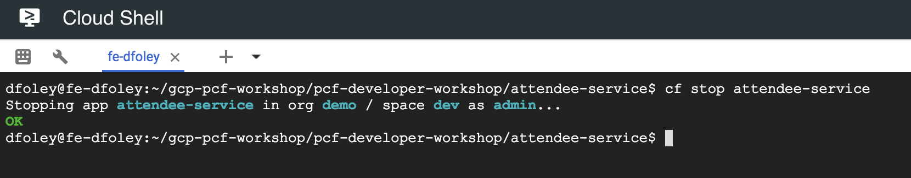

- If you also deployed **Awwvision, Link Shortener and Store Locator** you may also what to stop to free up resources.

```bash
cf stop awwvision
cf stop link-shortener
cf stop storelocator
```


### **STEP 22**: Generate Traffic

- Browse to the articulate Blue-Green page.

    

- Let’s assume that the deployed application is version 1. Let’s generate some traffic. Press the **Start** button. Leave this open as a dedicated tab in your browser. We will come back to this later.

- Observe our existing application handling all the web requests.

    

- Record the subdomain (host) for the articulate application. This is our production route. You will use this in the next step.

```bash
cf routes
```


### **STEP 23**: Deploy new version of application

- Now let’s push the next version of articulate.

```bash
cd ~/gcp-pcf-workshop/pcf-developer-workshop/articulate/
cf push articulate-v2 -p ./articulate-0.2.jar -m 768M -n {{articulate_hostname_temp}} --no-start
```


- Start the new version of the articulate-v2 app.

```bash
cf start articulate-v2
```


- Now we have two versions of our app deployed. Open a new tab and view version 2 of articulate in your browser. Take note of the application name.

    

### **STEP 24**: Route traffic to new version

- Let’s assume we are ready to start directing production traffic to version 2. We need to map our production route to articulate-v2.

```bash
cf map-route articulate-v2 apps.pcf.<yourdomain> --hostname <articulate_hostname>
```


- Return to browser tab where you started the load. You should see that it is starting to send requests to version 2.

    

- Move all traffic to version 2. Remove the production route from the articulate application.

```bash
cf unmap-route articulate apps.pcf.<yourdomain> --hostname <articulate_hostname>
```


- If you Reset the load generator, you will see all the traffic goes to articulate-v2.

    

- Remove the temp route from the articulate-v2 application.

```bash
cf unmap-route articulate-v2 apps.pcf.<yourdomain> --hostname <articulate_hostname>
```


- **Congratulations!** You performed a blue-green deployment.

- Let’s reset our environment. Delete the articulate application.

```bash
cf delete articulate
```

- Rename articulate-v2 to articulate.

```bash
cf rename articulate-v2 articulate
```

- Restart articulate.

```bash
cf restart articulate
```


<a id="pasadmin"></a>
## PAS Administrator Functions 

PAS Administrator manages application runtimes on Pivotal Cloud Foundry (PCF), including Pivotal Application Runtime (PAS), PAS for Windows 2012R2, Isolation Segment, and the Small Footprint Runtime.

This ongoing responsibility may include but is not limited to:

- Managing app routes and domains
- Managing orgs, spaces, and platform settings
- Analyzing app logs and generating usage reports
- Managing users and user roles
- Managing org and space billing
- Managing service plan access and service instances
- Enabling secure app communications
- Integrating app development tools

In this section we will explore some of these administrator activities. To learn more read the [PAS Administrator Guide](https://docs.pivotal.io/pivotalcf/2-2/pas/index.html).

### **STEP 25**: Creating and Managing Users with the cf CLI

Using the Cloud Foundry Command Line Interface (cf CLI), administrators, Org Managers, and Space Managers can manage users. Cloud Foundry uses role-based access control, with each role granting permissions in either an organization or an application space.

For more information you can access Pivotal Documentation at [here](https://docs.cloudfoundry.org/adminguide/cli-user-management.html)

- First step is to create the new user. Enter the following command:

```bash
cf create-user <username> <password>
```


- Next we will give our new user organization level role or **OrgManager**

```bash
cf set-org-role <username> demo OrgManager
```


- Last we want to give our new user a specific role for our space. We will treat this user as a developer and give the **SpaceDeveloper** role:

```bash
cf set-space-role <username> demo dev SpaceDeveloper
```


- Now that we have a new user we can login to the cf CLI with our new user.

```bash
cf login 
```


- Now you can access **cf CLI** commands as the new developer user. Also we can login to the App Manager as our new user and see how we only have access to Org's and Spaces that we have roles allocated.  

- From any browser, open a new tab and go to the URL:

   `https://apps.sys.pcf.<yourdomain>`

- Login with the newly create developer user. Notice that now you only have access to the **Demo** Org and no longer have access to the **System** Org. Only administrators should have access to system Org.

    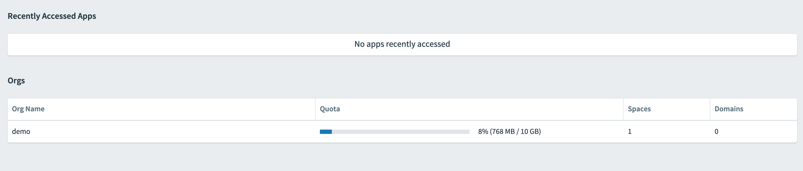


<a id="boshadmin"></a>
## BOSH Troubleshooting

**BOSH** is a project that unifies release engineering, deployment, and lifecycle management of small and large-scale cloud software. BOSH can provision and deploy software over hundreds of VMs. It also performs monitoring, failure recovery, and software updates with zero-to-minimal downtime. 

In this section we will explore using the BOSH CLI to help diagnose and resolve issues with your Pivotal Cloud Foundry (PCF) deployment. You can find out more about Advanced Troubleshooting with the BOSH CLI [here](https://docs.pivotal.io/pivotalcf/2-3/customizing/trouble-advanced.html).

### **STEP 26**: Check BOSH Deployments

A deployment is a collection of VMs, built from a stemcell, that has been populated with specific releases and disks that keep persistent data. These resources are created in the IaaS based on a deployment manifest and managed by the Director, a centralized management server.

- To view deployments we will need to install **BOSH CLI**. To find out more about **BOSH CLI** you can access instructions [here](https://bosh.io/docs/cli-v2-install/)

- From the Cloud Shell execute the following commands

```bash
cd ~
wget https://github.com/cloudfoundry/bosh-cli/releases/download/v5.3.1/bosh-cli-5.3.1-linux-amd64
chmod +x bosh-cli-5.3.1-linux-amd64
mv bosh-cli-5.3.1-linux-amd64 bin/bosh
bosh -v
```


- Next we will install the **om CLI**. OM is a tool that helps you configure and deploy tiles to Ops-Manager. To find out more about **OM** you can access documentation [here](https://github.com/pivotal-cf/om)

- To install execute the following commands:

```bash 
 wget https://github.com/pivotal-cf/om/releases/download/0.44.0/om-linux
 chmod +x om-linux
 mv om-linux bin/om
 om -v
```


- The **GCP Quickstart** comes with a script that helps setup your environment to use the **bosh CLI**.  Source the script **target-bosh.sh**

```bash
cd gcp-pcf-quickstart/
export ENV_DIR=$(pwd)/env/pcf
. ./util/target_bosh.sh
env | grep BOSH
```


- Now we are able to execute **bosh** commands against our environment. First let looks at the deployments. When you execute **bosh deployments** you will notice that we have 3 deployments **(Pivotal Application Service, GCP Service Broker, GCP Stackdriver Nozzle)**

```bash
bosh deployments
```


- Next we call look at the VM's associated with a specific deployment.  Use the PAS deployment name from the **bosh deployments** output as input for the next command. 

```bash
bosh -d <PAS deployment name> vms
```

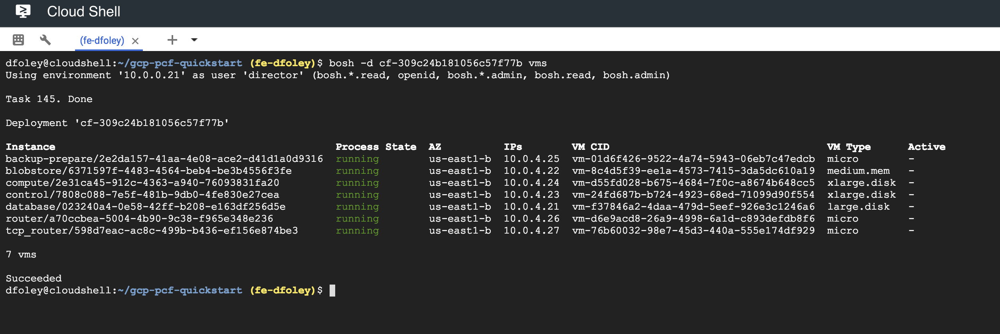

### **STEP 27**: BOSH cloud-check

- Run the **bosh cloud-check** command to instruct BOSH to detect differences between the VM state database maintained by the BOSH Director and the actual state of the VMs. 

```bash
bosh -d <PAS deployment name> cloud-check
```


### **STEP 28**: BOSH SSH

Use **bosh ssh** to log in to the VMs in your deployment with SSH.

- First we need to install the **netcat** utility.

```bash
sudo apt-get install netcat-openbsd
```


- Use the **BOSH vms** command to list out nall VM's for the PAS deployment. Capture instance name for the **control** VM.

```bash
bosh -d <PAS deployment name> vms
```


- Next use the instance name to SSH into the VM.

```bash
bosh -d <PAS deployment name> ssh VM-NAME/GUID
```

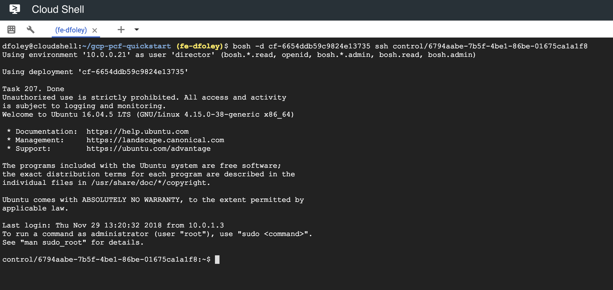

### **STEP 29**: Process Monitoring and Logs

The Agent on each deployment job VM is responsible for managing lifecycle of each enabled release job. It starts, monitors, restarts and stops release jobs' processes. These tasks are done with the help of the **Monit**. The Agent communicates with the Monit daemon through Monit HTTP APIs to add, remove, start, stop, monitor and unmonitor release jobs' processes. Learn more [here](https://bosh.io/docs/vm-monit/)

- First let switch to root user who has access to run the **monit** cli. As root we can execute **monit summary** to see what is running on the VM.  Since we are using the Small Foot print you will notice that many different process are running on the control VM.

```bash
sudo su -
monit summary
```


- You can assess on the VM at /var/vcap/sys/log/`<package>`/*.log. Learn more [here](https://bosh.io/docs/job-logs/)

```bash
ls /var/vcap/sys/log
```


- Feel free to look around at different logs.  If you had an issue with authentication you might want to look at the **uaa** logs.

```bash
ls /var/vcap/sys/log/uaa
```


- **You have completed workshop!!!**
