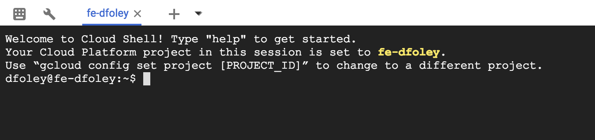

  
Update: September 5, 2018

## Introduction

This workshop will walk you through the process of deploying and monitoring an application on **Pivotal Cloud Foundry (PCF)**. PCF will be running on **Google Cloud Platform (GCP)** and you will get exposed how PCF consumes GCP services.

***To log issues***, click here to go to the [github](https://github.com/dfoleypivotal/gcp-pcf-workshop/issues) repository issue submission form.

## Objectives
- Install PCF on GCP using Quickstart
- Deploy an Application to PCF
- Understand how to Monitoring and Logging works in PCF
- Scale the number of instances of your application
- Understand High Availability capabilites of PCF platform
- Consume GCP Services from PCF application
- View PCF logs with GCP Stackdriver
- Understand how to do a Blue Green Deployment
- Setup Application Autoscaler

## Required Artifacts
- The following lab requires an Google Cloud Platform account.

## Create PCF platform on GCP using Quickstart.

### **STEP 1**: Open Cloud Shell
- From any browser, go to the URL to access Google Cloud Console:

   `https://console.cloud.google.com/`

- After you login to your GCP account click on Cloud Shell in the upper right hand corner.

    

- Cloud Shell will open in the bottom of your browser.

    

### **STEP 2**: Install PCF on GCP
- Open a new tab and go the following URL:

   `https://github.com/cf-platform-eng/gcp-pcf-quickstart`

- Follow the instruction for prerequisites, setup DNS and Deploy PCF

